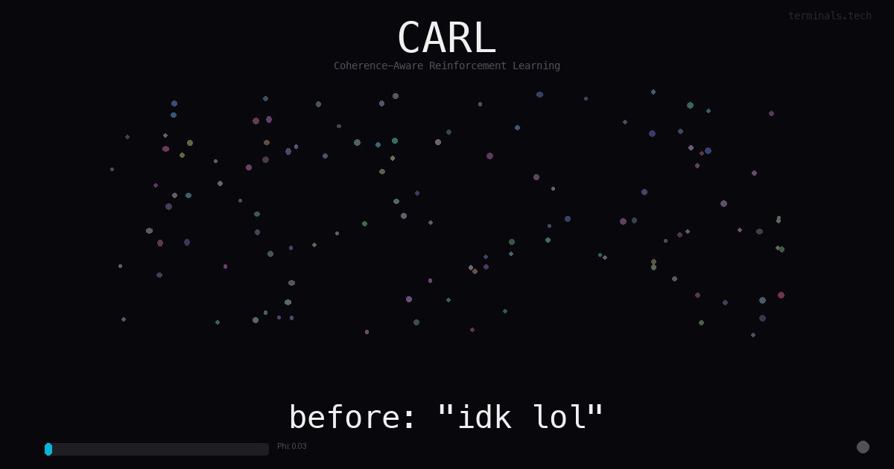

<p align="center">
  
</p>

<h1 align="center">CARL</h1>

<p align="center">
  <em>Coherence-Aware Reinforcement Learning</em>
</p>

<p align="center">
  <a href="https://pypi.org/project/carl-studio/"></a>
  <a href="https://pypi.org/project/carl-studio/"></a>
  <a href="LICENSE"></a>
  <a href="https://doi.org/10.5281/zenodo.18906944"></a>
</p>

---

## Why

A model becomes an agent when it stops pattern-matching and starts *knowing*. That transition isn't gradual — it's a **phase transition**, like water becoming ice. One moment the model is guessing. The next, it's coherent.

Standard training can't see this happening. You watch a loss curve and hope.

**CARL measures the moment of crystallization** — and rewards it.

```
                         Phi (order parameter)
                              │
          guessing            │         knowing
     ░░░░░░░░░░░░░░░░░░░░░░░░│████████████████████████
                              │
                        crystallization
```

The order parameter **Phi** measures how coherent a model's probability field is at every token. When Phi crystallizes, the model has found its internal anchor — a fixed point it can navigate from to *any* concept space without losing itself.

This is alignment you can measure, not just evaluate.

---

## Install

```bash
pip install carl-studio
```

## Use

**See inside any training run** (no GPU, no config):
```bash
carl observe --url https://your-trackio.hf.space
```

**Train with coherence rewards:**
```bash
carl train --model Qwen/Qwen3.5-9B --method grpo --compute a100
```

**Gate a checkpoint:**
```bash
carl eval --adapter your-username/your-model
```

---

## How It Works

```
 ┌─────────┐     ┌─────────┐     ┌─────────┐     ┌──────┐     ┌──────┐
 │ Observe │ ──> │ Measure │ ──> │  Train  │ ──> │ Gate │ ──> │ Ship │
 │         │     │   Phi   │     │  CARL   │     │      │     │      │
 └─────────┘     └─────────┘     └─────────┘     └──────┘     └──────┘
  point at        entropy +       task rewards     cascade      push to
  any run         order param     + coherence      auto-fires   hub
```

**Observe** — Point CARL at a Trackio dashboard or log file. Instantly see Phi trajectory, entropy, phase state, health.

**Measure** — Phi = 1 - H(P)/log|V|. Zero means maximum uncertainty. One means complete coherence. Computed per token, every step.

**Train** — Five reward functions in a cascade. Task rewards teach *what*. CARL rewards teach *how coherently*.

**Gate** — The cascade auto-calibrates from the training signal. No hardcoded thresholds. CARL activates only when the model demonstrates sustained capability.

**Ship** — Eval gate passes → checkpoint pushed to Hub.

---

## What's Free

Everything a researcher needs to train, observe, and evaluate.

| | Free | Pro | Enterprise |
|---|:---:|:---:|:---:|
| `carl observe` | | | |
| `carl train` (SFT, GRPO) | | | |
| `carl eval` (all phases) | | | |
| BYOK compute | | | |
| Real-time TUI | | | |
| Claude-powered diagnosis | | | |
| Autonomous pipeline (`--send-it`) | | | |
| MCP server (agent integration) | | | |

The gate is on **autonomy**, not capability. Train for free. Let CARL drive autonomously with Pro.

---

## Results

Trained with CARL on [OmniCoder-9B](https://huggingface.co/Tesslate/OmniCoder-9B):

| Metric | Value |
|--------|-------|
| Task completion | **92%** |
| Tool format compliance | 99% |
| Mean tool calls per task | 11.09 |
| Phase 2' eval gate | **PASS** |

80 GRPO steps. Five reward functions. Self-calibrating cascade gate.

---

## Papers

The math is published and independently reproducible:

- [Bounded Informational Time Crystals](https://doi.org/10.5281/zenodo.18906944) — derives the conservation law
- [Material Reality](https://doi.org/10.5281/zenodo.18992029) — validates across 6,244 trials
- [Semantic Realizability](https://doi.org/10.5281/zenodo.18992031) — formal proof

---

## Reference

Architecture, API, CLI commands, environments, compute backends → [docs/reference.md](docs/reference.md)

---

## Star History

<a href="https://star-history.com/#wheattoast11/carl&Date">
  <picture>
    <source media="(prefers-color-scheme: dark)" srcset="https://api.star-history.com/svg?repos=wheattoast11/carl&type=Date&theme=dark"/>
    <source media="(prefers-color-scheme: light)" srcset="https://api.star-history.com/svg?repos=wheattoast11/carl&type=Date"/>
    
  </picture>
</a>

---

<p align="center">
  <a href="https://terminals.tech">terminals.tech</a> · <a href="https://pypi.org/project/carl-studio/">PyPI</a> · <a href="https://doi.org/10.5281/zenodo.18906944">Paper</a> · <a href="docs/reference.md">Docs</a>
  <br/><br/>
  MIT — <a href="https://terminals.tech">Intuition Labs LLC</a>
</p>
