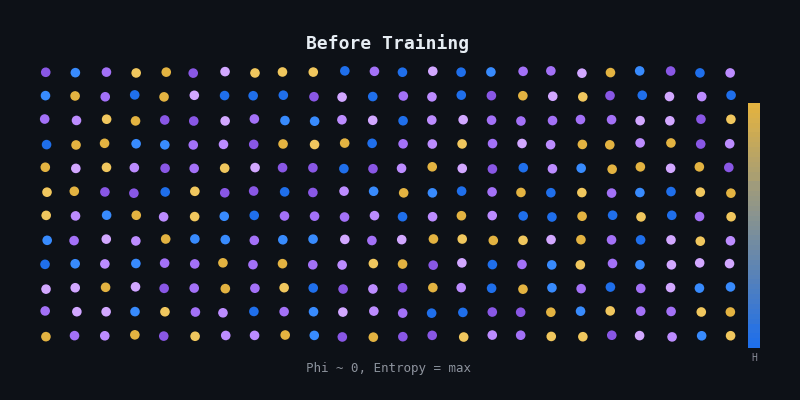

# CARL Studio

**Coherence-Aware Reinforcement Learning**

> Models don't learn gradually -- they crystallize.



## What is CARL?

CARL adds information-theoretic reward signals to RL training that measure *how* a model generates, not just *what* it generates. Three components -- multiscale coherence, cloud quality, and discontinuity targeting -- are derived from a single conservation law: `T* = kappa * d` where `kappa = 64/3` and the semantic quantum `sigma = 3/16`.

## Install

```bash
pip install carl-studio
```

## Quick Start

```python
from carl_studio import CARLTrainer, TrainingConfig

trainer = CARLTrainer(TrainingConfig(
    base_model="Qwen/Qwen3.5-9B",
    method="grpo",
    dataset_repo="trl-lib/Capybara",
    compute_target="l4x1",
))
run = await trainer.train()
```

## CLI

```bash
carl train --model Qwen/Qwen3.5-9B --method grpo --compute l4x1
carl train --config carl.yaml
carl bundle --config carl.yaml --output train.py
carl mcp --transport stdio
```

## The Conservation Law

| Constant | Value | Meaning |
|----------|-------|---------|
| kappa | 64/3 = 21.333 | Conservation constant |
| sigma | 3/16 = 0.1875 | Semantic quantum (noise floor) |
| kappa * sigma | **4** | Bits per embedding dimension |
| T* | kappa * d | Decompression boundary |

For triadic dimensions `d = 3 * 2^k`:

| d | T* | Notes |
|---|----|-------|
| 768 | 16,384 | GPT-2 class |
| 3,072 | 65,536 | Llama class |
| 12,288 | 262,144 | Frontier class |

Non-triadic dimensions incur a ~33% context tax.

## Key Finding: Phase Transitions

During VLM SFT (OmniCoder-9B + vision encoder), the model exhibits a first-order phase transition:

| Steps | Phase | Loss | Accuracy | Entropy | What happens |
|-------|-------|------|----------|---------|--------------|
| 0-10 | Baseline | 22.8 | 3% | 1.0 | Pre-training distribution intact |
| 10-20 | Melting | 15.2 -> 8.4 | 3% -> 8% | 1.0 -> **9.3** | Distribution completely destabilizes |
| 20-25 | **Transition** | 8.4 -> 3.7 | 8% -> **65%** | 9.3 -> 4.1 | Accuracy jumps 57 points in 5 steps |
| 25-35 | Crystallization | 3.7 -> 0.13 | 65% -> 99% | 4.1 -> 0.4 | Rapid convergence |
| 35-46 | Converged | 0.06 | **99.3%** | 0.12 | Fully crystallized |

Entropy spikes to near-maximum (9.3), then accuracy discontinuously jumps once the system passes the critical coupling threshold. This is consistent with Kuramoto synchronization in coupled oscillator systems.

Text-only SFT shows a milder transition (entropy ~1.1). The magnitude scales with the distance between target and pre-training distributions.

## Architecture

```
Layer 3  MCP Server     9 tools for AI agent consumption
         ─────────────────────────────────────────────
Layer 2  CLI            carl train | observe | bundle | mcp
         ─────────────────────────────────────────────
Layer 1  SDK            CARLTrainer, TrainingConfig, rewards, cascade
         ─────────────────────────────────────────────
Layer 0  Primitives     CoherenceProbe, compute_phi, kappa, sigma
```

### Reward Components

```
R_CARL = 0.50 * R_multiscale + 0.30 * R_cloud + 0.20 * R_discontinuity
```

| Component | What it measures |
|-----------|-----------------|
| Multiscale coherence | Phi consistency across dyadic block scales 2^j |
| Cloud quality | P(selected) * Phi -- confident AND correct |
| Discontinuity targeting | Context-dependent scoring of sharp Phi transitions |

### Order Parameter

```
Phi = 1 - H(P) / log|V|
```

0 = uniform (maximum uncertainty). 1 = delta (complete certainty).

## Compute Backends

| Backend | Type | Flag |
|---------|------|------|
| HuggingFace Jobs | Managed UV scripts | `--compute l4x1` |
| RunPod | GPU pods | `--compute runpod` |
| Tinker | Managed API | `--compute tinker` |
| Prime Intellect | GPU marketplace | `--compute prime` |
| SSH | Remote execution | `--compute ssh` |
| Local | Direct GPU | `--compute local` |

## Known Limitation: The Coherence Trap

CARL's reward landscape has a degenerate optimum at mode collapse. A model outputting identical tokens with 99.98% confidence scores high on all three components because maximum coherence IS a delta function. Population-level diversity term planned for v2. See [the paper](paper/carl-paper.md), Section 5.2.3.

## Citation

```bibtex
@article{desai2026carl,
  title   = {Coherence-Aware Reinforcement Learning},
  author  = {Desai, Tej and {Claude Opus 4.6}},
  year    = {2026},
  url     = {https://github.com/terminals-tech/carl-studio},
  note    = {Intuition Labs LLC}
}
```

## IP Boundaries

CARL Studio implements Coherence-Aware RL using MIT-licensed mathematics derived from the [CC-BY-4.0 CARL paper](paper/carl-paper.md). The conservation law, order parameter, and reward components are independently derivable from published equations.

This package does **not** include:
- Kuramoto oscillator dynamics (proprietary Terminals Platform, BUSL-1.1)
- Audio coherence / FFT-to-phase mapping (proprietary CHORD module)
- Cross-substrate isomorphisms (Sematon, GateSequencer)
- Material Reality empirical datasets (6,244 trials)
- Interactive Research Environment (IRE) runtime

These remain in the [Terminals Platform](https://terminals.tech) under BUSL-1.1.

## License

MIT -- Intuition Labs LLC
