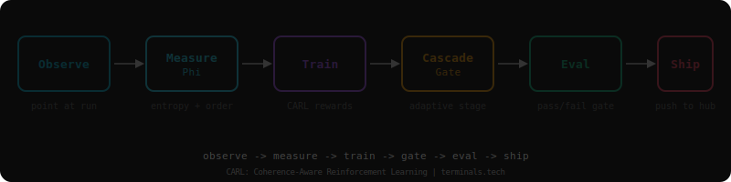

<p align="center">
  
</p>

<h1 align="center">CARL Studio</h1>

<p align="center">
  <strong>Coherence-Aware Reinforcement Learning</strong><br/>
  Train, observe, and evaluate LLMs using information-theoretic reward signals.
</p>

<p align="center">
  <a href="https://pypi.org/project/carl-studio/"></a>
  <a href="https://pypi.org/project/carl-studio/"></a>
  <a href="LICENSE"></a>
  <a href="https://doi.org/10.5281/zenodo.18906944"></a>
  <a href="https://wheattoast11-trackio.hf.space/"></a>
</p>

---

Models don't learn gradually -- they **crystallize**. CARL measures this by computing an order parameter from the model's probability field at every token. Standard RLHF rewards *what* a model says. CARL rewards *how coherently* it thinks.

## Install

```bash
pip install carl-studio
```

## 30-Second Demo

Point CARL at any training run. No GPU, no config, no setup:

```bash
carl observe --url https://wheattoast11-trackio.hf.space/
```

Output:
```
  HEALTH: GREEN -- stable training, coherence rising
  ──────────────────────────────────────────────────
  Phi trajectory:  ▁▂▃▃▅▆▇▇██  (0.31 -> 0.78)
  Entropy:         mean=3.41  std=0.82  min=0.12  max=9.3
  Phase state:     crystallizing (phi rising, defects falling)
  Cloud quality:   0.42 (P(selected) * Phi)
  Lyapunov proxy:  0.008 (stable)
  Conservation:    kappa*sigma = 4.00
  ──────────────────────────────────────────────────
  Rewards:  task ▁▂▃▅▇██  engage ▃▅▆▇▇▇▇  CARL ▁▁▂▃▅▆▇
```

## CARL vs. Standard Training

| | Standard RLHF/GRPO | CARL |
|---|---|---|
| **Reward signal** | Task accuracy only | Task + coherence field (Phi, entropy, discontinuities) |
| **When to stop** | Loss plateau or manual check | Phi convergence + phase transition detection |
| **Failure detection** | Loss goes up | Zero-gradient basin detection, tool death alerts, band tightening |
| **Quality signal** | None during training | Cloud quality (P(selected) * Phi) every step |
| **Cascade gating** | Manual stage switching | Self-calibrating adaptive gate from metric distribution |
| **Observability** | TensorBoard scalars | Crystal field: entropy, phi trajectory, Lyapunov stability, defect choreography |

## Real Working Examples

### 1. Observe a Run (FREE)

```python
from carl_studio.observe.data_source import TrackioSource

source = TrackioSource(space="wheattoast11-trackio", run_name="phase2prime-env-grpo-v11")
frames = source.fetch_latest(n=20)

for f in frames:
    print(f"step={f.step}  phi={f.phi_mean:.3f}  entropy={f.entropy:.2f}  reward={f.reward:.3f}")
```

### 2. Train with CARL Rewards (FREE)

```python
from carl_studio import CARLTrainer, TrainingConfig

config = TrainingConfig(
    run_name="my-coding-agent",
    base_model="Qwen/Qwen3.5-9B",
    output_repo="your-username/my-agent",
    method="grpo",
    dataset_repo="your-username/your-data",
    compute_target="a100",
    max_steps=100,
)

trainer = CARLTrainer(config)
run = await trainer.train()
print(f"Job: {run.hub_job_id}  Phi: {run.phi_mean:.3f}")
```

### 3. Evaluate a Checkpoint (FREE)

```bash
carl eval --adapter your-username/my-agent --phase phase2prime
```

```
  EVAL RESULTS -- Phase 2' Environment GRPO
  ──────────────────────────────────────────
  Task completion:       92.00%
  Tool format:           99.00%
  Mean tool calls:       11.09
  PHASE 2' GATE:         PASS
```

### 4. Full Autonomous Pipeline (PRO)

```bash
carl train --send-it --model Qwen/Qwen3.5-9B --compute a100
```

This runs: SFT -> eval gate -> GRPO -> eval gate -> push to Hub. Each stage auto-advances when the gate passes. No manual intervention.

### 5. Live Dashboard (PRO)

```bash
carl observe --live --url https://wheattoast11-trackio.hf.space/
```

Real-time Textual TUI with phi sparklines, metrics table, and completion log.

### 6. Claude-Powered Diagnosis (PRO)

```bash
carl observe --diagnose --url https://wheattoast11-trackio.hf.space/
```

Sends crystal metrics to Claude for expert analysis: phase transition detection, scale-separated convergence checks, discontinuity choreography assessment.

## Architecture

```
Layer 4  MCP Server       9 tools for AI agent consumption
         ──────────────────────────────────────────────────
Layer 3  CLI              carl observe | train | eval | config | status | logs
         ──────────────────────────────────────────────────
Layer 2  Training         CARLTrainer, CascadeRewardManager, environments
         ──────────────────────────────────────────────────
Layer 1  SDK              TrainingConfig, EvalRunner, CoherenceProbe, Settings
         ──────────────────────────────────────────────────
Layer 0  Primitives       compute_phi(), kappa, sigma, CoherenceTrace
```

## The Reward

```
R_CARL = 0.50 * R_coherence + 0.30 * R_cloud + 0.20 * R_discontinuity
```

| Component | Measures | Intuition |
|-----------|----------|-----------|
| Multiscale coherence | Phi consistency across dyadic block scales | "Is the model coherent at all resolutions?" |
| Cloud quality | P(selected) * Phi | "Is it confident AND correct?" |
| Discontinuity targeting | Sharp Phi transitions at structural boundaries | "Does it commit at the right moments?" |

## The Conservation Law

```
kappa = 64/3          T* = kappa * d         (decompression boundary)
sigma = 3/16          kappa * sigma = 4      (bits per embedding dimension)
Phi = 1 - H(P)/log|V|                        (order parameter)
```

Three papers, independently reproducible:
- [Bounded Informational Time Crystals](https://doi.org/10.5281/zenodo.18906944) -- derives kappa, T*
- [Material Reality](https://doi.org/10.5281/zenodo.18992029) -- validates across 6,244 trials
- [Semantic Realizability](https://doi.org/10.5281/zenodo.18992031) -- formal proof of sigma

## Cascade Gating

CARL rewards are length-biased. Without gating, they dominate sparse task signal and cause mode collapse. The cascade solves this:

```
Stage A (early):   task rewards only         -- "learn to use tools"
Stage B (gated):   task + CARL rewards       -- "now do it coherently"
```

The gate self-calibrates from the task metric's running distribution. No hardcoded threshold.

## CLI Reference

**Core (FREE):**
```
carl observe [--url URL] [--file PATH]    See crystal metrics on any run
carl train [--config carl.yaml]           Train with CARL rewards
carl eval [--adapter HUB_ID]              Pass/fail checkpoint gate
carl config [show|set|init|preset]        Manage settings
carl status <id>                          Job status
carl logs <id>                            Job logs
carl stop <id>                            Cancel job
carl push                                 Push checkpoint to Hub
carl bundle                               Generate self-contained script
carl compute                              List GPU flavors
```

**Autonomous (PRO):**
```
carl observe --live                       Real-time TUI dashboard
carl observe --diagnose                   Claude-powered analysis
carl train --send-it                      Full SFT->gate->GRPO->eval->push pipeline
carl bench --cti                          CARL Trainability Index report
```

**Agent Integration (ENTERPRISE):**
```
carl mcp                                  Start MCP server (9 tools)
```

## Compute Backends

| Backend | Flag | VRAM |
|---------|------|------|
| HuggingFace Jobs | `--compute l4x1` / `a100` / `h200` | 24-141 GB |
| RunPod | `--compute runpod` | Configurable |
| Local | `--compute local` | Your GPU |

## Model-Agnostic

`ModelSpec.from_pretrained()` auto-detects architecture, modality, thinking mode, quantization, and LoRA targets from any HuggingFace config.json.

| Model | Status |
|-------|--------|
| Qwen 3.5 9B VLM | Primary -- 92% task completion, 99% format |
| Qwen 3.5 35B MoE | Tested (attention-only LoRA) |
| Gemma 4 | Planned (TRL tool support pending) |

## Environments

Built-in sandbox environments for agent training:

| Environment | Tools | Use Case |
|-------------|-------|----------|
| `CodeSandboxEnv` | read_file, write_file, execute_code, run_shell | Coding agents |
| `SQLSandboxEnv` | execute_query, list_tables, describe_table, insert_data | Data agents |

## Tiers

| | FREE | PRO | ENTERPRISE |
|---|---|---|---|
| Observe (basic) | Yes | Yes | Yes |
| Train (SFT, GRPO) | Yes | Yes | Yes |
| Eval (all phases) | Yes | Yes | Yes |
| BYOK Compute | Yes | Yes | Yes |
| Live TUI Dashboard | | Yes | Yes |
| Claude Diagnosis | | Yes | Yes |
| Autonomous Pipeline | | Yes | Yes |
| MCP Server | | | Yes |
| Custom Environments | | | Yes |
| Multi-tenant | | | Yes |

## IP Boundaries

| What | Where | License |
|------|-------|---------|
| Conservation law, Phi, rewards, CLI | **CARL Studio** (this repo) | MIT |
| Resonance LR, SLOT/TTT, Kuramoto, diagnosis | **terminals-runtime** | BUSL-1.1 |
| Audio coherence (CHORD), cross-substrate | Terminals Platform | BUSL-1.1 |

## Citation

```bibtex
@article{desai2026carl,
  title   = {Coherence-Aware Reinforcement Learning},
  author  = {Desai, Tej},
  year    = {2026},
  url     = {https://github.com/wheattoast11/carl},
  note    = {Intuition Labs LLC}
}
```

## Star History

<a href="https://star-history.com/#wheattoast11/carl&Date">
  <picture>
    <source media="(prefers-color-scheme: dark)" srcset="https://api.star-history.com/svg?repos=wheattoast11/carl&type=Date&theme=dark"/>
    <source media="(prefers-color-scheme: light)" srcset="https://api.star-history.com/svg?repos=wheattoast11/carl&type=Date"/>
    
  </picture>
</a>

---

<p align="center">
  <a href="https://terminals.tech">terminals.tech</a> | <a href="https://pypi.org/project/carl-studio/">PyPI</a> | <a href="https://doi.org/10.5281/zenodo.18906944">Paper</a>
  <br/>
  MIT -- Intuition Labs LLC
</p>
